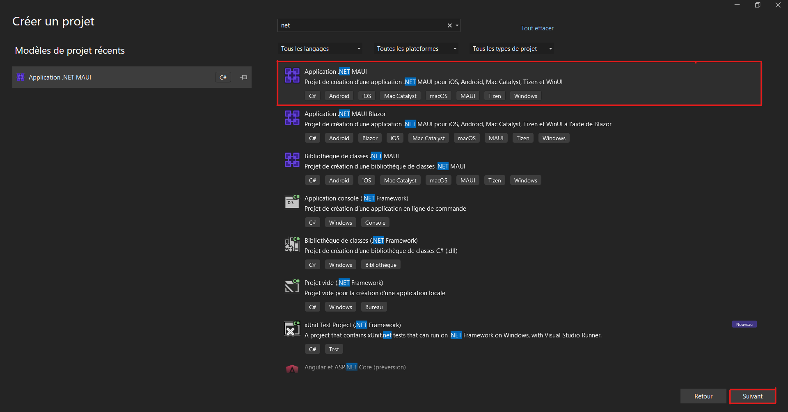

# Project work 2

For this week, I choose to join the blue team. I have too much difficulties to communicate because we had a very huge group and the communcation 
between the members was not enough. 
Also I preferred to be more guided so it was a good solution. 

As we restarted with a new team, we had to recreate a git, a group discord to communicate with our teamates and to recreate a kanban. 

## Tutorial 1 : Getting started

The aim of this tutorial is to create a simple notes application which stores notes as text files.

With this tutorial we will learn all of the following things :
-Create a .NET MAUI Shell app.
-Run your app on your chosen platform.
-Define the user interface with eXtensible Application Markup Language (XAML), and interact with XAML elements through code.
-Create views and bind them to data.
-Use navigation to move to and from pages.

The first step of the tutorial is to create a new project on Visual Studio. 

<figcaption><b>Fig.1.1 - How to create a new project</b></figcaption>  

## Tutorial 2 : MVVM

## Tutorial 3 : Adding a database

Week 10 is the third and last week in a series in which the goal is to improve your 
personal software engineering practice. Your portfolio entry has the same general content
as last week's, including:

* A descriptive summary of the issue that you worked on.
* Snippets from your code with commentary showing how you have used good software design 
  practice.
* A descriptive summary of the test code that you have written.
* A reflective summary of any changes that were requested during the code review along 
  with your fixes.
* A descriptive summary of any issues you found with the code that you were asked to review.
* A general reflective section that identifies, for example,
  * New things you have realised this week
  * Common problems that can arise in a team development situation
  * How your practice compares to other people's
  * etc.

Be sure to include links to the original items in the team's GitHub repository.

In the reflective sections this week, you should highlight ways that you persona practice
has improved as before. It would also be good to reflect on any improvements that have
been made to the agreed team workflow and related procedures. Are things working
better than they were? What further improvements could be made in the future?
