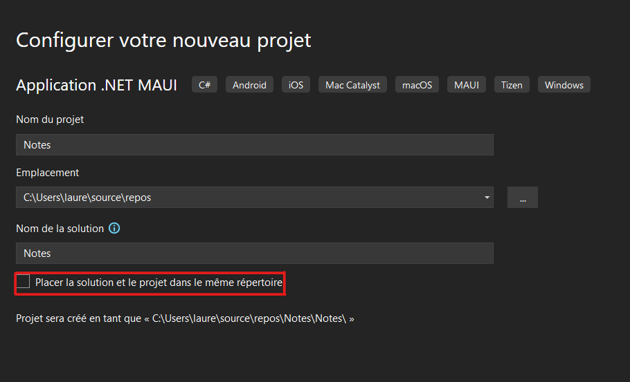

# Project work 2

For this week, I choose to join the blue team. I have too much difficulties to communicate because we had a very huge group and the communcation 
between the members was not enough. 
Also I preferred to be more guided so it was a good solution. 

As we restarted with a new team, we had to recreate a git, a group discord to communicate with our teamates and to recreate a kanban. 

## Tutorial 1 : Getting started

The aim of this tutorial is to create a simple notes application which stores notes as text files.

With this tutorial we will learn all of the following things :
-Create a .NET MAUI Shell app.
-Run your app on your chosen platform.
-Define the user interface with eXtensible Application Markup Language (XAML), and interact with XAML elements through code.
-Create views and bind them to data.
-Use navigation to move to and from pages.

The first step of the tutorial is to create a new project on Visual Studio. 
Before that we had to install  .NET Multi-platform App.

<figcaption><b>Fig.1.1 - NET.MAUI</b></figcaption>  

<figcaption><b>Fig.1.1 - how to configure our new project</b></figcaption>  

After following all the steps in the tutorial, I was able to understand how to organise my project properly.
To work in a team it's important to understand this,
otherwise the members of our team won't be able to understand us and therefore won't be able to work with us.

## Tutorial 2 : MVVM

The aim of this tutorial is to understand the model-view-viewmodel (MVVM).
I already what it is and how it function.
With my previous team, we used to work with this pattern.
But I did it anyway to make sure I clearly understand everything.

## Tutorial 3 : Adding a database

For this tutorial we had to install NuGet packages but i already had it.

With this tutorial I learnt how to create a database context.
So now I can use a database in my project.

## General reflective

This week enabled me to learn in detail how Visual Studio works and how to clearly configure a project. 
At the begining I didn't really understood how a XAML page worked but now I understand better. 
In conclusion, this week has helped me to clarify how to organise my projects properly and how to use databses.
It gave me a better understanding of the work in general and what we had to do. 
We were able to redo a new git repository for our team and we'll be able to start our project again 
in a clearer and better organised way.

## Our git repository
https://github.com/AloiSan/UndacBlue