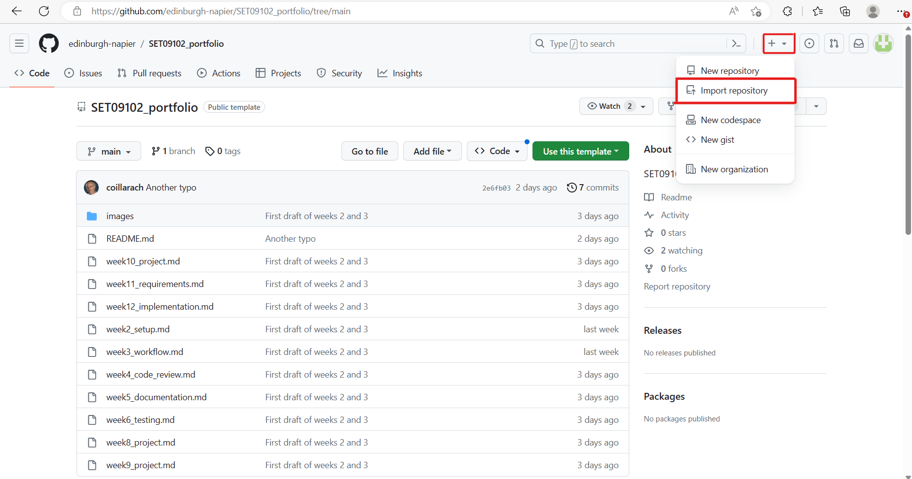
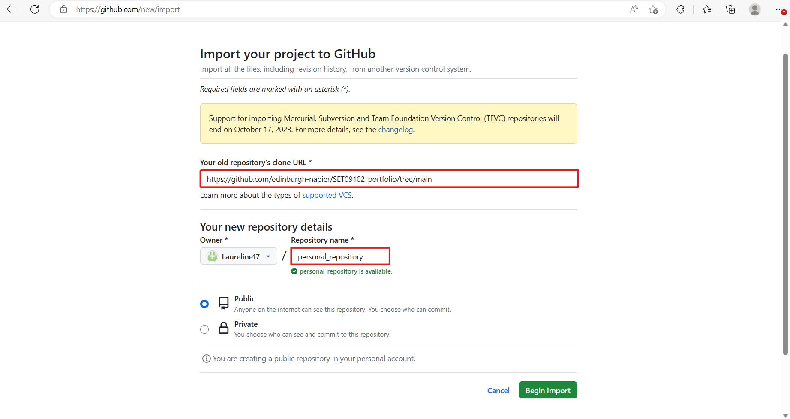
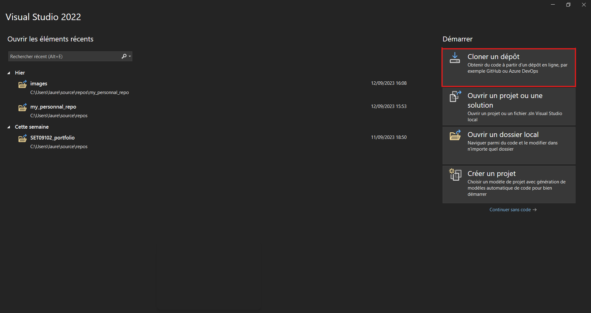
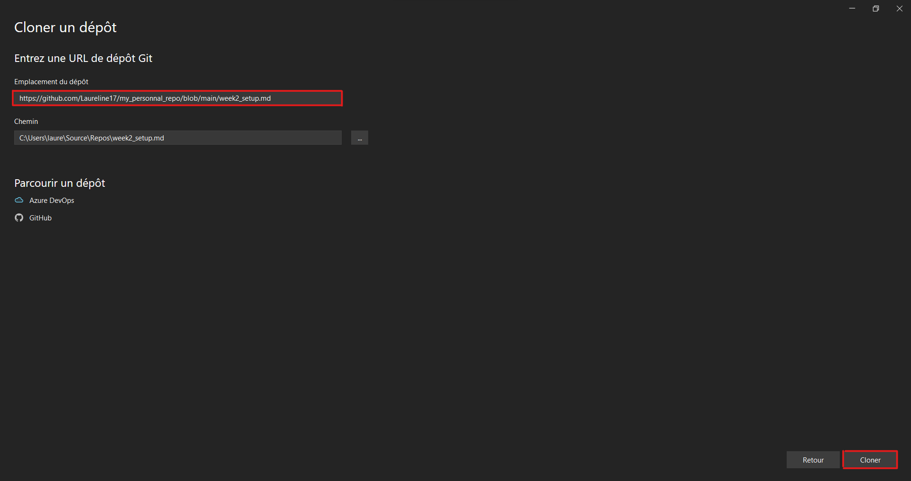
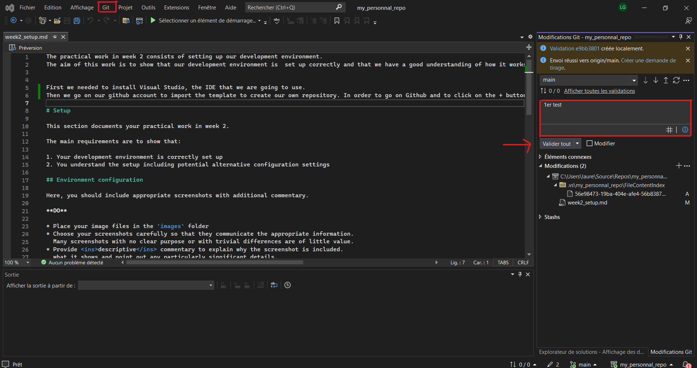
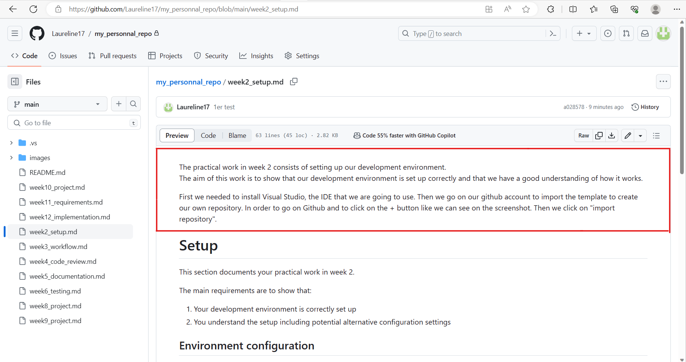

# Setup

The practical work in week 2 consists of setting up our development environment.   
The aim of this work is to show that our development environment is  set up correctly and that we have a good understanding of how it works. 

## Environment configuration

**1 - Fist step : create our repository ** 

First we needed to install Visual Studio, the IDE that we are going to use. 
Then we go on our github account to import the template to create our own repository. 
In order to go on Github and to click on the + button like we can see on the figure1.1.  
Then we click on "import repository" like we can see on the figure1.1.  

<figcaption><b>Fig.1.1 - Where to click to import a repository</b></figcaption> 

Then we have to enter the old repository's clone URL. 
It is the URL of the template, and we give our repository a new name like i did on the figure 1.2.  
Then we click on submit and we can find the template of the portfolio on our account. 

<figcaption><b>Fig.1.2 - Where to copy the link of the repository</b></figcaption> 

**2 - Second step : clone on visual studio ** 

Now we want to have access to it on Visual Studio. For that, we have to clone it.
So we open Visual Studio wich we have previously downloaded. We have the choice between few options.  
But we have to click on "clone a repository" like i show on the figure 2.1 and then we have to enter the template of the protfolio's URL. 
then you have to click on the button cloner like you can see on my figure 2.2. 
Now we have access to our portfolio and we can make some changes on it.  

<figcaption><b>Fig.2.2 - where to click to clone a repository on Visual Studio</b></figcaption> 

<figcaption><b>Fig.2.2 - where to enter the address of the template</b></figcaption> 

**3 - Third step : commit and push ** 

To make sure it works, I try to do a commit and push. So first we have to do a modification on the portfolio.
Then we write a comment to discribe what we change and we validate this comment. 
When it is done you click on the button git on the left and then click on send.  

<figcaption><b>Fig.3.1 - How to make a commit on visual studio</b></figcaption> 

Then, when we come back to git on my personnal repository, we can see on the figure3.2 that the modifications appear.  

<figcaption><b>Fig.3.2 - Verification on GitHub</b></figcaption> 

**4 - Fourth step : join the repository shared with the group ** 

A member of our group create the shared repository and send us an invitation by email.  
We had to click on accept the invitation.  
And we had to do the exact same step to clone it on visual studio.  

## Reflection

My development environment is complet and correctly set up.
Now I can work on projects with my teamates.
The repository shared with the group permit us to work on the same project.

I had some difficulties to add some images. But after few try I finally understand how to do it. 

F

