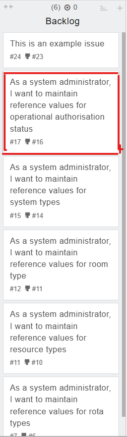
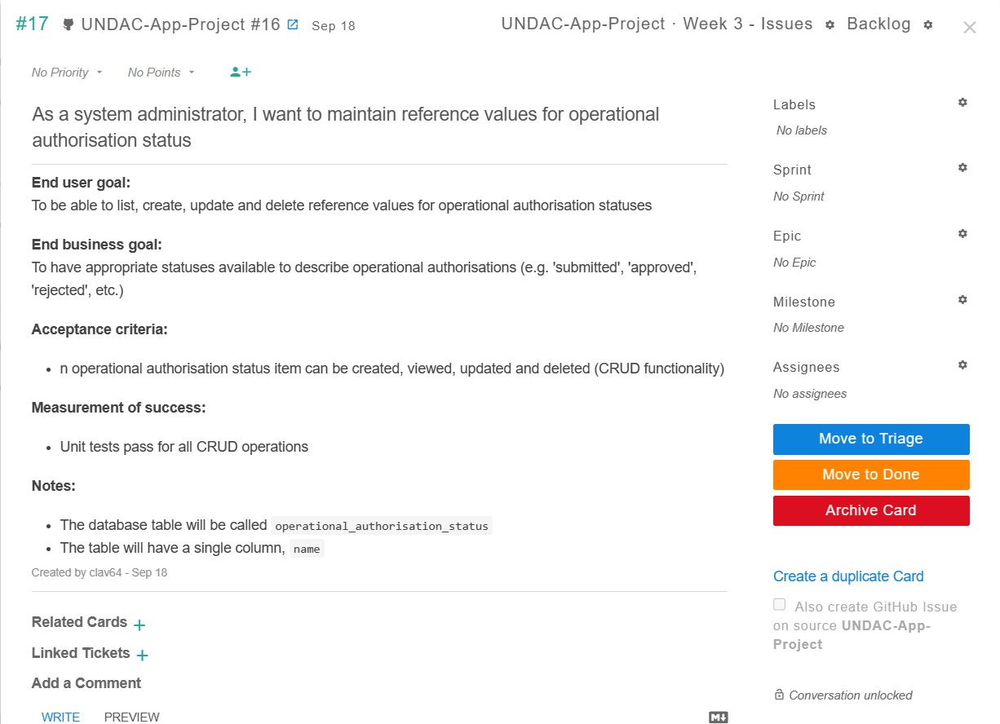
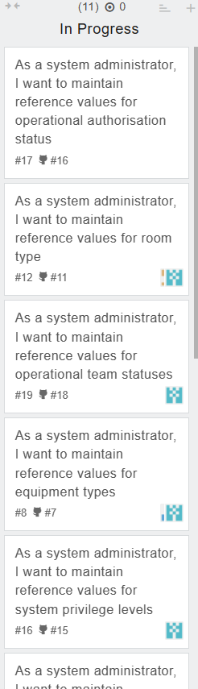

# Workflow

The practical in week 3 consists to learn how to use the worflow tools. 

## Task workflow

First, we had to join the project created for our group on zube.

The next step was to choose a task and to assign it to yourself.

<figcaption><b>Fig.1 - Where you can find tasks available</b></figcaption>  

You can click on the card to see the details of your task.

<figcaption><b>Fig.2 - Description of the task</b></figcaption>  

When I started my task I can put the task in the section "in progress".

<figcaption><b>Fig.3 - Section in progres on kanban</b></figcaption>  

With GitHub's Workflow tools,we can see our teamates's work and we can work together on a project without conflicts.

## Reflection

I had some dificulties to do my task so I tried to understand how it works.
And as soon as I understand I will put it on my branch on giyhub so my classmates could have it.
